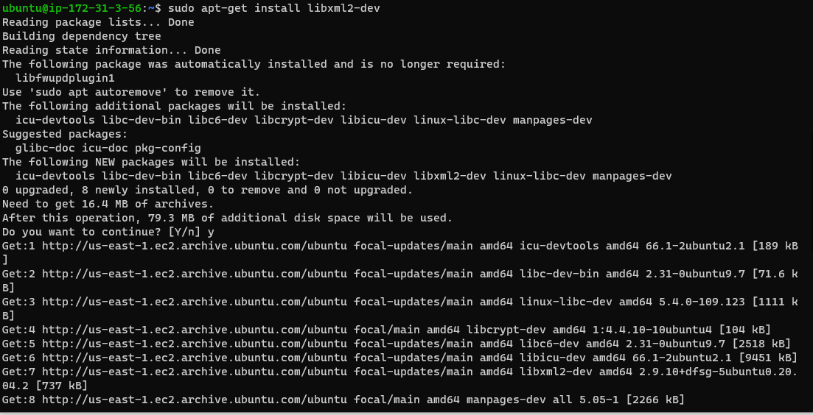
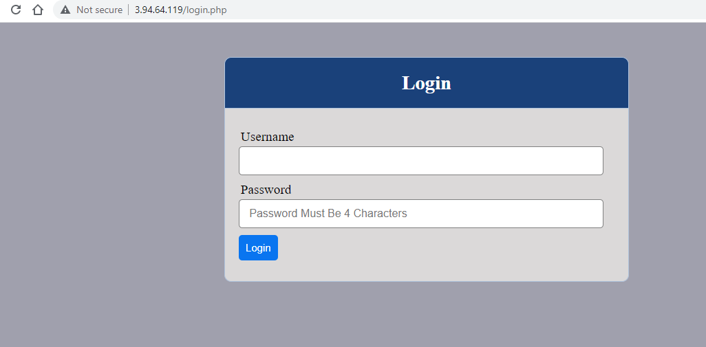

# Documentation of Project 8
1. I created an ubuntu server 20.04 EC2 instance and named it "project8-lb".

   

2. I opened TCP port 80 on my newly created instance

3. I installed apache load balancer on my server and configured it to point traffic coming to lb to the web servers.
       
       `sudo apt update`

`sudo apt install apache2 -y`

`sudo apt-get install libxml2-dev`

`sudo a2enmod rewrite`

`sudo a2enmod proxy`

`sudo a2enmod proxy_balancer`

`sudo a2enmod proxy_http`

`sudo a2enmod headers`

`sudo a2enmod lbmethod_bytraffic`

   
    
     
      

4. I restarted apache2
  
   `sudo systemctl restart apache2`

    

5.  I configured the load balancing and verified the configuration by accessing the lb's public address from my browser and it worked.

 
    